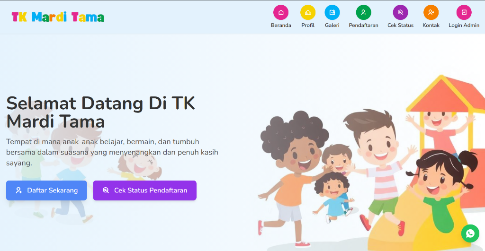
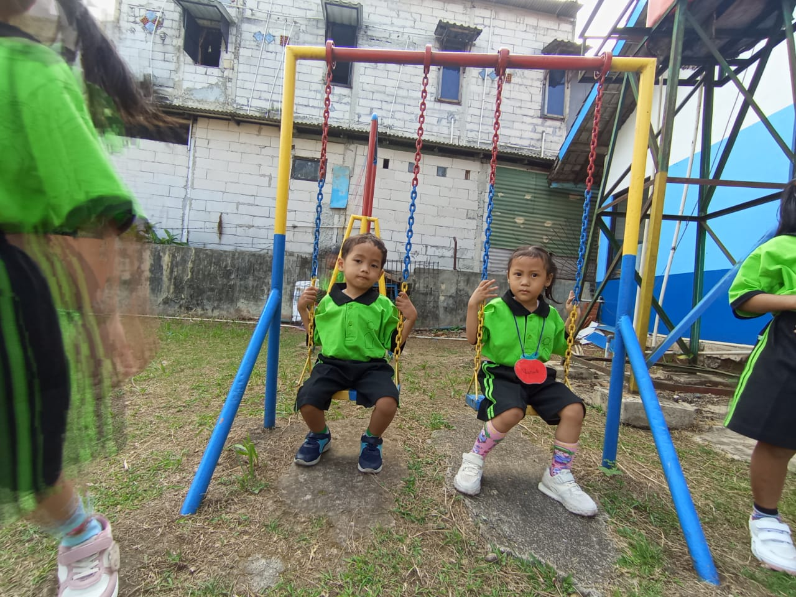
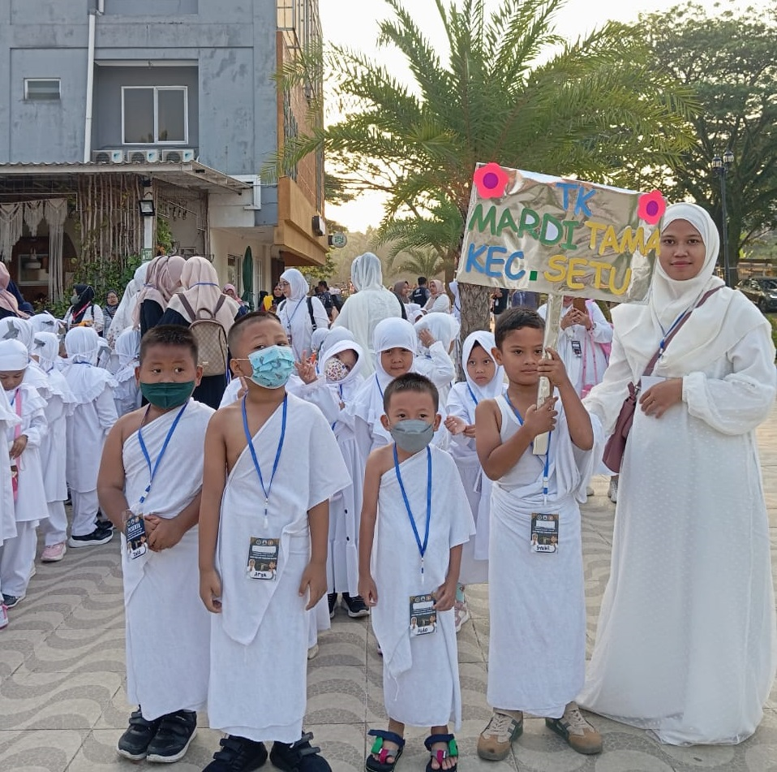
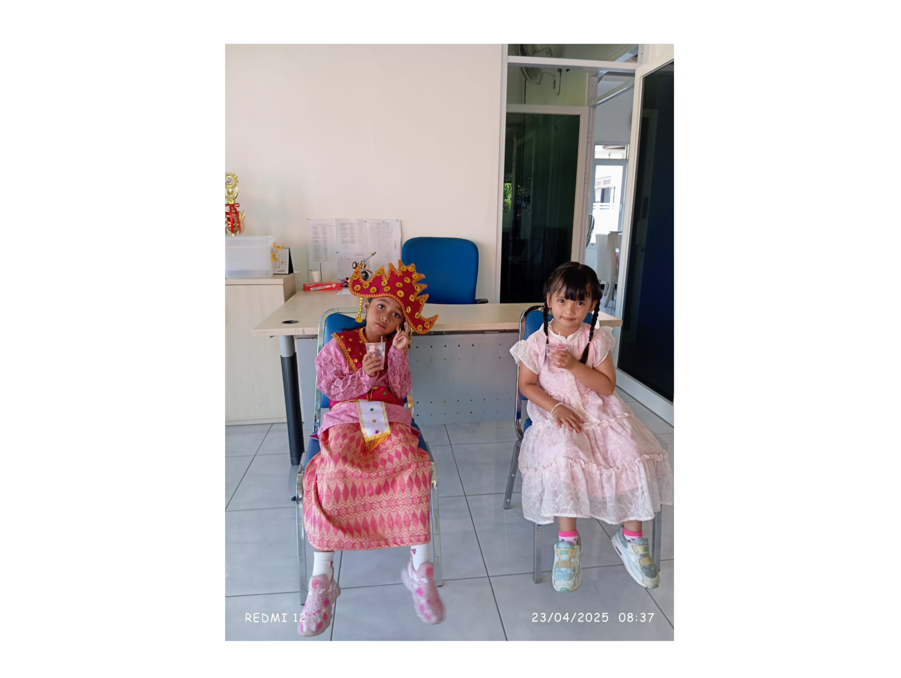

# 🎒 PPDB Online TK Mardi Tama

Aplikasi Web Penerimaan Peserta Didik Baru (PPDB) Online berbasis **Laravel 10** yang dilengkapi dengan Panel Administrator modern, verifikasi berkas, grafik analitik, notifikasi WhatsApp 1-Click, serta ekspor data rekap ke CSV/Excel.

---

## 🌟 Fitur Utama

### 🌐 1. Sisi Publik (Orang Tua / Wali Murid)
- **Landing Page Interaktif & Responsive**: Informasi profil sekolah, galeri kegiatan, rincian biaya, dan jadwal gelombang pendaftaran.
- **Formulir Pendaftaran Multi-Step (3 Langkah)**: Pengisian data calon siswa, data orang tua/wali, dan pengunggahan berkas syarat (Pas Foto, Akta, KK, Surat Kesehatan).
- **Kode Pendaftaran Unik Otomatis**: Setiap pendaftar secara otomatis menerima kode pendaftaran unik (contoh: `PPDB-2026-A1B2`).
- **Cek Status Pendaftaran Publik**: Orang tua dapat mengecek status pengajuan (*Pending*, *Diterima*, *Ditolak*) menggunakan Kode Pendaftaran, Nama Anak, atau Nomor HP.
- **Tombol WhatsApp Melayang**: Kemudahan berkonsultasi langsung dengan panitia sekolah.

### 🛡️ 2. Sisi Panel Administrator (`/admin`)
- **Proteksi Autentikasi Middleware**: Seluruh rute admin terlindungi oleh rute aman `auth`.
- **Dashboard Analytics (Chart.js)**: Visualisasi grafik *doughnut* interaktif untuk perbandingan status kelulusan dan rasio gender pendaftar.
- **Verifikasi & Manajemen Status**: Memperbarui status kelulusan (*Pending / Diterima / Ditolak*) secara cepat disertai catatan panitia.
- **Notifikasi WhatsApp 1-Click**: Tombol direct `wa.me` yang menyusun pesan pengumuman kelulusan otomatis ke orang tua murid.
- **Cetak Bukti Pendaftaran Resmi**: Template cetak siap print atau simpan sebagai PDF ber-kop surat resmi.
- **Export Data Rekap ke CSV/Excel**: Mengunduh seluruh rekap pendaftar dengan 1 klik.
- **Pengaturan Dinamis Biaya & Gelombang**: Admin bisa mengubah biaya sekolah (Uang Pangkal, SPP, Formulir) dan jadwal gelombang secara langsung dari dashboard.
- **Kelola User & Profil Admin**: Manajemen akun administrator dan ubah password mandiri.

---

## 📸 Tampilan Antarmuka & Galeri Sekolah

### 🌐 Halaman Utama (Public Landing Page)


<details>
<summary><b>🖼️ Klik di sini untuk melihat Galeri & Foto Kegiatan Sekolah (▶)</b></summary>
<br>







</details>

---

## 🛠️ Teknologi & Modul (Tech Stack)

- **Framework Backend**: Laravel 10.x (PHP 8.1 / 8.4)
- **Database**: MySQL / MariaDB
- **UI Framework**: Tailwind CSS 3.4 & Bootstrap 5.3
- **Visualisasi Data**: Chart.js
- **Icon Set**: Remixicon & Bootstrap Icons
- **ORM & Storage**: Eloquent & Storage Disk Public

---

## 🚀 Panduan Instalasi & Jalankan Lokal

Follow langkah-langkah di bawah untuk menginstal dan menjalankan projek di environment lokal (Laragon / XAMPP):

### 1. Clone / Buka Folder Projek
```bash
cd c:\laragon\www\ppdb-tk
```

### 2. Install Dependensi Composer
```bash
composer install
```

### 3. Konfigurasi Environment (`.env`)
Salin file `.env.example` menjadi `.env` dan atur konfigurasi database MySQL kamu:
```ini
APP_NAME="PPDB TK Mardi Tama"
APP_URL=http://127.0.0.1:8000

DB_CONNECTION=mysql
DB_HOST=127.0.0.1
DB_PORT=3306
DB_DATABASE=ppdb_tk
DB_USERNAME=root
DB_PASSWORD=
```

### 4. Generate App Key & Link Storage
```bash
php artisan key:generate
php artisan storage:link
```

### 5. Jalankan Migrasi & Database Seeder
```bash
php artisan migrate:fresh --seed
```

### 6. Jalankan Server Lokal
```bash
php artisan serve
```
Buka browser dan akses **[http://127.0.0.1:8000](http://127.0.0.1:8000)**.

---

## 🔑 Kredensial Login Admin Default

Setelah menjalankan `php artisan migrate:fresh --seed`, gunakan kredensial berikut untuk masuk ke **[http://127.0.0.1:8000/login](http://127.0.0.1:8000/login)**:

| Username | Password | Role |
|---|---|---|
| `Rizky Ariyan` | `password` | Administrator |
| `admin` | `admin123` | Administrator |

---

## 🧪 Pengujian Otomatis (Automated Testing)

Projek ini dilengkapi dengan pengujian otomatis *Feature & Unit Testing* menggunakan PHPUnit:

```bash
php artisan test
```

---

## 📝 Lisensi & Hak Cipta

Diproduksi untuk **TK Mardi Tama**. Hak Cipta Dilindungi &copy; 2025.
